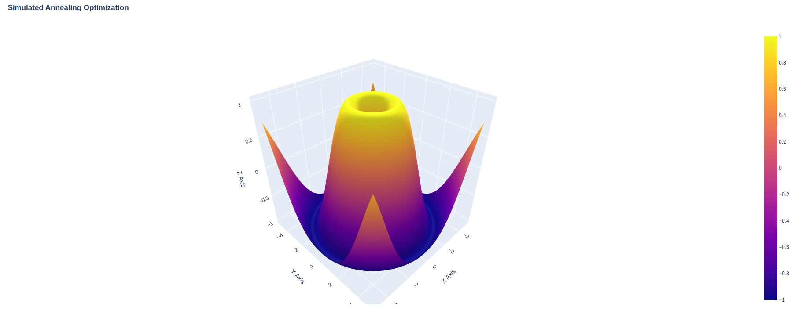

## Description
Simulated Annealing Optimization is a probabilistic technique for approximating the global optimum of a given function. It is often used for large optimization problems where finding an exact solution is impractical. This project demonstrates the implementation of the Simulated Annealing algorithm to solve optimization problems.

## Algorithms explained

### Simulated Annealing
As the temperature decreases, the algorithm becomes more selective, accepting fewer changes. It uses the Metropolis criterion to occasionally accept worse solutions to escape local optima. The process continues until a set number of iterations or a minimum temperature is reached.

#### Hyperparameters:
1. **Initial Temperature (T0)**: 100.0
   - The starting temperature, which should be high enough to allow the algorithm to explore the solution space freely.
2. **Cooling Schedule**: Exponential decay
   - A function that determines how the temperature decreases over time. Common schedules include exponential decay and logarithmic decay.
3. **Number of Iterations (MaxIter)**: 1000
   - The total number of iterations the algorithm will run.
4. **Acceptance Probability Function**: Metropolis criterion
   - Determines the probability of accepting a worse solution, typically based on the difference in solution quality and the current temperature.

### Genetic Algorithm for SA Hyperparameters
The Genetic Algorithm is an optimization technique inspired by natural selection. It evolves a population of solutions over generations to find the best one. It is used for optimizing the hyperparameter of the SA algorithm.

#### Hyperparameters:
1. **Population Size**: 50
   - The number of individuals in each generation.
2. **Mutation Rate**: 0.01
   - The probability of randomly altering an individual's genes.
3. **Crossover Rate**: Not specified in the code, but typically around 0.7
   - The probability of combining two parents to produce offspring.
4. **Number of Generations**: 100
   - The total number of generations the algorithm will run.
5. **Selection Method**: Tournament selection (k=3)
   - The method used to select parents for reproduction, such as roulette wheel selection or tournament selection.
6. **Fitness Function**: Based on the objective function
   - A function that evaluates and assigns a fitness score to each individual based on their performance.

### Genetic Algorithm Process

1. **Initialization**:
   - A population of potential solutions (hyperparameter sets) is created randomly within given bounds.

2. **Evaluation**:
   - Each individual in the population is evaluated using an objective function, which in this case would measure the performance of the SA algorithm with the given hyperparameters.

3. **Selection**:
   - Parents are selected from the population based on their performance scores. Better-performing individuals have a higher chance of being selected.

4. **Crossover**:
   - Pairs of parents are combined to produce offspring. This is done by exchanging parts of the parents' hyperparameters to create new sets.

5. **Mutation**:
   - Offspring undergo random mutations with a certain probability. This introduces variability and helps explore the solution space.

6. **Elitism**:
   - The best-performing individuals (elite) are preserved and carried over to the next generation to ensure that the best solutions are not lost.

7. **Iteration**:
   - Steps 2-6 are repeated for a number of iterations. Over time, the population evolves, and the best solutions (hyperparameter sets) are refined.

8. **Convergence**:
   - The algorithm stops after a predefined number of iterations or when improvements become negligible. The best hyperparameter set found is returned.

## Screenshots

